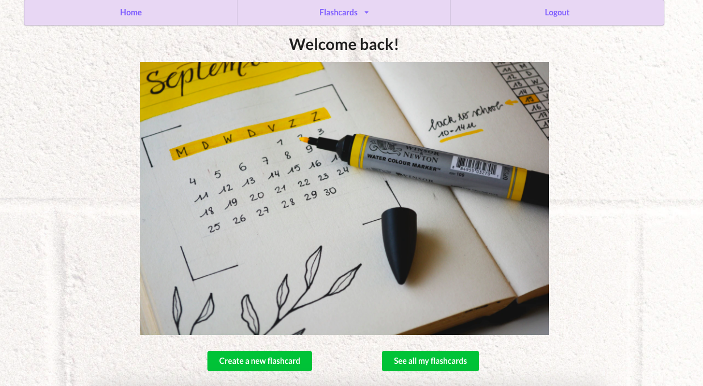
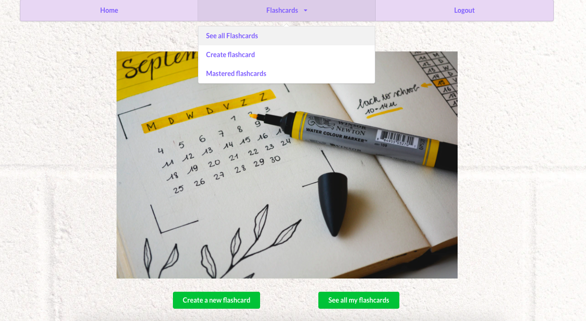
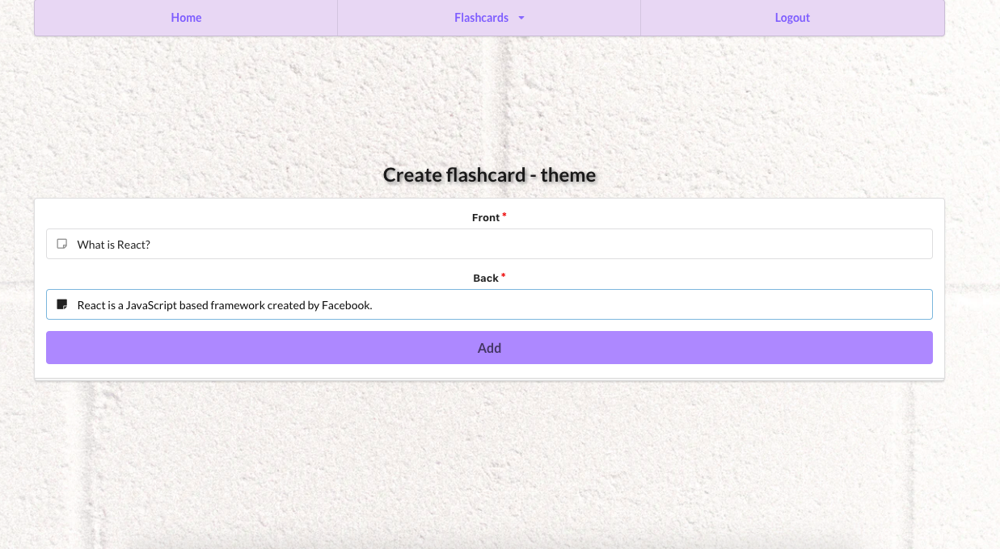
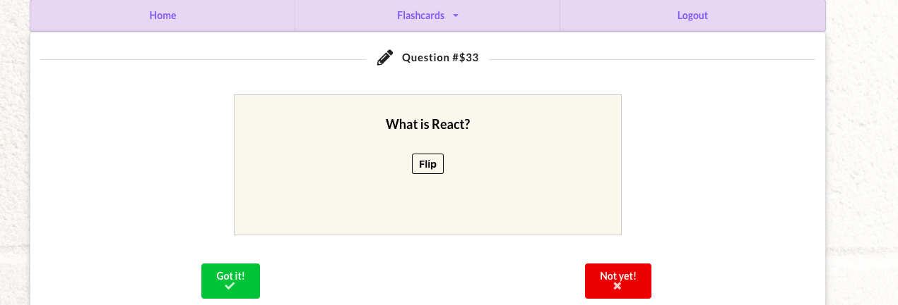

# 💻 Spacers flashcard App (BETA)

Helping you remember things easier, one flashcard at a time. Front end for [space-api.](https://github.com/euqueme/spacer-api) 
Project for Microverse's first Hackathon.

This is a flashcards application that uses the
[spaced memorization technique](https://en.wikipedia.org/wiki/Spaced_repetition).

Welcome!
<br>
<br>
You can create several cards with concepts you want to master.
<br>
And quiz yourself until you do. 


## 🔨 Tools
- React
- React-DOM
- Redux
- Semantic UI
- React-Create-App
- Npm
- CSS
- ES6

## ✨ Live Demo

You can look at it [here]( https://spacers-rep.netlify.app/).

## 🚀 Getting Started

To get a local copy up and running follow these simple example steps.

### Requirements

- Latest version of **[NodeJS](https://nodejs.org/en/)** _-- (npm included)_.

### Setup

First, clone (or fork) this repository.

```sh
git clone https://github.com/misselliev/spacers-frontend.git && cd spacers-frontend
```

Then, install the dependencies.

```sh
npm install
```

Once you are done with the previous steps, open up in your localhost.

```sh
npm run start
```

An special npm script is available for linting, using Eslint and Stylelint. 

```sh
npm run lint
```

## 👤 Contributors
- [misselliev](https://github.com/misselliev)
- [FelipeEnne](https://github.com/FelipeEnne)
- [euqueme](https://github.com/euqueme)
- [santiago-rodrig](https://github.com/santiago-rodrig)

## 🤝 Contributing

Contributions, issues and feature requests are welcome!

Feel free to check the [issues page](issues/).

## Show your support

Give a ⭐️ if you like this project!

> “What simple action could you take today to produce a new momentum toward success in your life?” Tony Robbins
